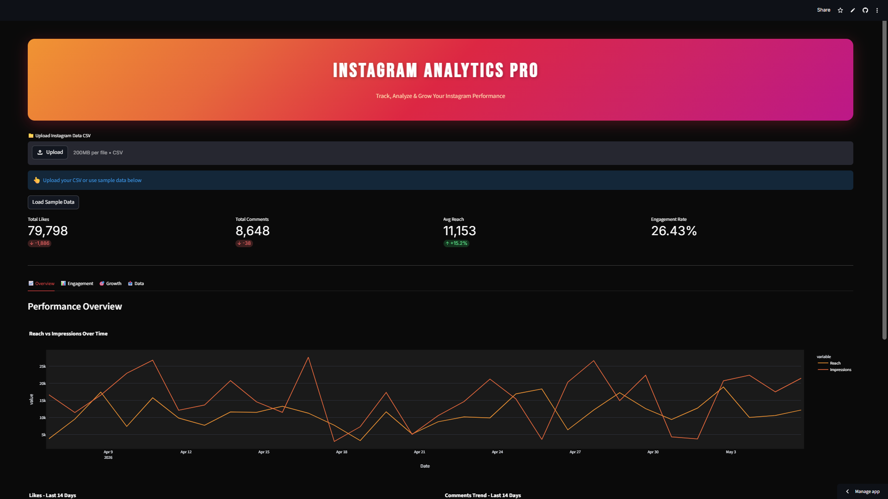

# Instagram Analytics Pro 📱 | Social Media Dashboard

Interactive Streamlit dashboard to track, analyze & grow Instagram performance. Upload your Instagram data CSV and get instant insights on engagement, reach, growth trends, and content performance.

### 🚀 Live Demo
**[Click Here to Launch Dashboard](https://instagram-analytics-dashboard-olmmsnwohjse5pbpcqg3rv.streamlit.app/)**

### 📸 Dashboard Preview


### 📈 Key Metrics Tracked
- **Total Likes**: 79,798
- **Total Comments**: 8,648  
- **Avg Reach**: 11,153 | +15.2% growth
- **Engagement Rate**: 26.43%

### 🔥 Key Features

**1. Overview Tab**
- KPI cards: Likes, Comments, Reach, Engagement Rate with % change
- Performance Overview dashboard
- Reach vs Impressions Over Time line chart

**2. Engagement Tab**
- Likes - Last 14 Days bar chart
- Comments Trend - Last 14 Days area chart
- Best posting time analysis
- Top performing posts identification

**3. Growth Tab**
- Follower growth tracking
- Reach & Impression trends
- Account growth rate over time

**4. Data Tab**
- Upload Instagram Data CSV up to 200MB
- Use sample data for demo
- Filter by date range, post type, hashtags
- Export filtered analytics to CSV

### 💡 Business Questions This Dashboard Answers
1. What is my current engagement rate and is it improving?
2. Which day/time gives maximum likes and comments?
3. How is my reach trending vs impressions? 
4. Which content type drives the most engagement?

### 🛠️ Tech Stack
- **Frontend**: Streamlit
- **Data Processing**: Pandas, NumPy
- **Visualization**: Plotly, Matplotlib
- **Data Source**: Instagram Export CSV / Meta API
- **Deployment**: Streamlit Community Cloud

### 💻 Run Locally
```bash
git clone https://github.com/akash1234-design/instagram-analytics-pro
cd instagram-analytics-pro
pip install -r requirements.txt
streamlit run app.py
